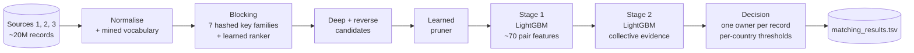

<div align="center">

# 🔗 Business Entity Resolution at Scale

### Amazon ML Challenge 2026 · Team **Future bytes**

Matching **1.7 million** businesses to their noisy duplicates among **10 million** records —
across India, the US and a country the model had **never seen**.


</div>

---

## ✨ Highlights

| | |
|---|---|
| 🏁 **Leaderboard (macro F0.5)** | **0.979130** |
| 🧪 **Validation (macro F0.5)** | **0.9879** (India + US, held-out businesses) |
| 🎯 **Candidate recall** | **98.1 %** with only ~5–7 candidates per business |
| 🌍 **Unseen country** | France handled without a single labelled example |
| 🧩 **100 % data-derived** | no external data, dictionaries, geocoding or pretrained models |
| 💻 **Runs on a laptop** | 12 CPU threads, 12 GB RAM |

## 📑 Contents

[The problem](#-the-problem) · [Approach](#-approach) · [Results](#-results) ·
[Key insights](#-key-insights) · [What didn't work](#-what-didnt-work) ·
[Repository](#-repository) · [Getting started](#-getting-started) · [Team](#-team)

---

## 🧩 The problem

Three independent sources describe the same real-world businesses, with no shared IDs. **Source 1** is the
clean reference list; for each of its businesses, find every matching record in **Sources 2 and 3**.
The records are deliberately noisy — an (invented) example of what one business can look like:

| Source | Name | Address |
|---|---|---|
| **S1** (reference) | Sunrise Traders Private Limited | 12 MG Road, Pune, Maharashtra |
| S2 | SUNRISE TRADERS PVT LTD | #12 M.G. RD, PUNE, MH |
| S3 | सनराइज ट्रेडर्स प्राइवेट लिमिटेड | 12, Pune, Maharashtra |
| S3 | sunrisetraders.com | |
| ⚠️ S2 — *a different business* | Sunrise Traders Holdings | 14 MG Road, Pune |

Abbreviations, typos, reordered and missing address parts, native scripts, glued web names, empty
addresses — and look-alike decoys that must **not** be matched.

- **Scale:** 2.2M / 5.0M / 5.3M training records with 7.64M true pairs; 1.7M / 4.9M / 5.1M test records.
- **Metric:** F0.5 per Source-1 business, macro-averaged — **precision counts twice as much as recall**.
  A business with no match scores 1.0 only if nothing is predicted for it.
- **Twist:** the test set adds **France**, which never appears in training.

## 🏗️ Approach



| Stage | What it does | Why it matters |
|---|---|---|
| **Vocabulary mining** | Learns `rd → road`, `mh → maharashtra`, legal forms and a native-script → Latin dictionary from matched training pairs | Normalises records without any hand-written dictionary |
| **Blocking** | Per-country inverted index over 7 hashed key families (rare words, name-word pairs, house number × street word, glued names, …); a LightGBM ranker keeps the top 35 per business | Cuts 10M × 1.7M possible pairs to ~50 per business |
| **Deep + reverse candidates** | Keeps look-alike candidates ranked 36–120, and the best business for every Source-2/3 record | Recovers true pairs the top-35 cut crowds out (e.g. empty addresses) |
| **Pruner** | Cheap LightGBM filter on blocking signals | ~5–7 candidates left per business, recall kept |
| **Stage 1** | LightGBM on string similarities, IDF-weighted overlaps, house-number agreement and candidate competition; out-of-fold | Unbiased pair probabilities for stage 2 |
| **Stage 2** | Adds evidence from *all* stage-1 scores: who else claims the record, how many confident matches the business has, whether the candidate resembles the business's records or its rejected look-alikes | Decisions made in context, not pair by pair |
| **Decision** | Each record goes to at most one business; thresholds per country; rules against test-only decoys | Precision where F0.5 rewards it |

<details>
<summary><b>More technical detail</b></summary>

- **Blocking keys** are XOR-combined 64-bit hashes (word-order invariant), scored by IDF; keys that are too
  frequent are skipped. Memory-bounded: key tables are built in slices and spilled to disk per block.
- **Deep candidates** use a cheap pair score (name token-set + address token-set + 100 × house-number
  Jaccard ≥ 160, at most 20 per business) because the ranker's probability is near zero beyond rank 35.
- **Out-of-fold training:** businesses are hashed into two folds; each fold's model scores the other fold,
  so stage 2 learns from realistic stage-1 probabilities. Validation and test use the fold average.
- **No-lift rule:** stage 2 may lower but never raise a pair that stage 1 rejected.
- **Uncontested rule:** a record only one business wants needs a confident stage-1 probability.
- **Unseen country:** vocabulary maps mined from confident test predictions, two rounds of self-training,
  and a strict threshold.

The full methodology — EDA, every experiment and the error analysis — is in
[Documentation_template.md](Documentation_template.md).
</details>

## 📈 Results

| Step | Validation | Leaderboard | Δ leaderboard |
|---|---|---|---|
| Single LightGBM, forward blocking | 0.9822 | 0.973 | — |
| + reverse blocking, two-stage model, decoy rules | 0.9856 | 0.977 | +0.004 |
| + deep candidates | 0.9873 | 0.977619 | +0.0006 |
| + France threshold 0.995 | — | 0.978259 | +0.0006 |
| + native-script alignment, all training data | **0.9879** | **0.979130** | **+0.0009** |

Validation = macro F0.5 on 10 % of the training businesses held out by hash (India + US only).

## 💡 Key insights

**1. The test set was not like validation.**
It contains far more records of businesses that are *absent* from Source 1 — look-alikes at neighbouring
addresses. The model had learned *"a record nobody else wants is probably a match"*: true in training,
false on test. A stage-2 model that looked better on validation **dropped** the leaderboard from 0.973 to
0.970; two rules that stop trusting uncontested records brought it to **0.977**.

**2. An unseen country makes the model over-confident.**
France's "fairly confident" matches (probability 0.85–0.99) were mostly wrong. Submissions that differed
*only* in France's threshold traced the curve — 0.85 → 0.95 → 0.98 → 0.99 → **0.995** → 0.999 — and the
peak added +0.0006.

**3. Recall is decided in blocking.**
Half of the remaining validation loss came from true pairs that never became candidates. Deep and reverse
candidates raised candidate recall from 97.5 % to 98.1 %.

**4. Mined dictionaries can be subtly wrong.**
Co-occurrence mining mapped the Hindi word for *private* to *limited* — the two always appear together.
Aligning native-script names word by word with their Latin form fixed it (+0.0009 on India).

## 🧪 What didn't work

| Idea | Result |
|---|---|
| Stage 2 trusted as-is | Leaderboard 0.973 → **0.970** (test-only decoys) |
| Self-training stage 2 on France | −0.0001 on the leaderboard |
| Stricter threshold for India/US | −0.0002 (they are well calibrated) |
| House-number group features | Right for training data, wrong for test decoys |
| Smaller trees, stronger regularisation, normalised features | No gain on a simulated unseen country |

## 📂 Repository

```
.
├── code/business_entity_resolution/
│   ├── src/                      # the pipeline — entry point: run_all.py
│   │   ├── normalize.py, prep.py        text cleaning
│   │   ├── mine_tokens.py, mine_pseudo.py  vocabulary mining (training / unseen country)
│   │   ├── blocking.py, block_ranker.py, prune.py   candidate generation
│   │   ├── features.py                  pair features
│   │   ├── train.py, stage2.py          stage 1 / stage 2 models
│   │   ├── adapt.py                     self-training for the unseen country
│   │   └── predict.py, decide.py, metric.py   decisions, outputs, F0.5
│   ├── reference/token_maps.json # exact vocabulary maps of the final submission
│   ├── README.md                 # step-by-step reproduction guide
│   └── requirements.txt
└── Documentation_template.md     # methodology document submitted to the challenge
```

## 🚀 Getting started

> The competition data is **not** included — it belongs to the challenge organisers.

```bash
git clone https://github.com/karthikeya0922/amazon-ml-challenge-2026.git
cd amazon-ml-challenge-2026
pip install -r code/business_entity_resolution/requirements.txt
# place the data as Dataset/student_resource/dataset/{train,test}/*.tsv, then:
cd code/business_entity_resolution/src
python run_all.py        # -> output/matching_results.tsv + output/candidate_pairs.tsv
```

A full run takes several hours on a 12-thread CPU. Individual steps, resuming from a step, and exact
reproduction are described in the [reproduction guide](code/business_entity_resolution/README.md).

## 👥 Team

**Future bytes** — Karthikeya Gupta · Sreekar Kumar

Built for the **Amazon ML Challenge 2026** (Business Entity Resolution). Every model and mapping is
learned from the data provided by the challenge; no external data or pretrained models were used.
